<h2 align="center">  Hi there, I'm Haniki 👋</h2>

    

# 👋 About Me
<table width="100%" border="0" cellpadding="0" cellspacing="0">
  <tr>
    <td width="50%" align="center" valign="middle">
      
    </td>
    <td width="50%" align="center" valign="middle">
      
    </td>
  </tr>
</table>

---
### 🐍 Contribution Trail

  <picture>
    <source media="(prefers-color-scheme: dark)" srcset="https://raw.githubusercontent.com/Haniki2k4/Haniki2k4/output/github-contribution-grid-snake-dark.svg">
    <source media="(prefers-color-scheme: light)" srcset="https://raw.githubusercontent.com/Haniki2k4/Haniki2k4/output/github-contribution-grid-snake.svg">
    
  </picture>

### 📬 Connect
- LinkedIn: [linkedin.com/in/Haniki2k4](https://www.linkedin.com/in/Haniki2k4/)
- GitHub: [@Haniki2k4](https://github.com/Haniki2k4)
---

### 👨‍💻 Languages
**Languages & data:**  

**Backend & tools:**  

### 🤖 Data Science & AI
**Data science & AI:**  

**Databases:**  

---

### 🧩 Selected Builds

| Project | What it does | Stack |
| --- | --- | --- |
| [EpiScoutAI](https://github.com/Haniki2k4/epi-scout-ai-main) | A public-health research project exploring a RAG-based chatbot and information retrieval for epidemiological content. | Python · FastAPI · MySQL · MiniLM · Docker |

---
### 📈 GitHub Pulse

  
  

---

*“Build useful things, keep learning, and make the work speak for itself.”*

<!-- AWAKEN:START -->
<!-- Generated by git-profile-awaken. Edit awaken.json instead of this block. -->

<picture><source media="(prefers-color-scheme: dark)" srcset="awaken/hunter-dark.svg"><source media="(prefers-color-scheme: light)" srcset="awaken/hunter-light.svg"></picture>

<picture><source media="(prefers-color-scheme: dark)" srcset="awaken/ladder-dark.svg"><source media="(prefers-color-scheme: light)" srcset="awaken/ladder-light.svg"></picture>

<picture><source media="(prefers-color-scheme: dark)" srcset="awaken/web-dark.svg"><source media="(prefers-color-scheme: light)" srcset="awaken/web-light.svg"></picture>
<picture><source media="(prefers-color-scheme: dark)" srcset="awaken/skills-dark.svg"><source media="(prefers-color-scheme: light)" srcset="awaken/skills-light.svg"></picture>

<picture><source media="(prefers-color-scheme: dark)" srcset="awaken/activity-dark.svg"><source media="(prefers-color-scheme: light)" srcset="awaken/activity-light.svg"></picture>

<picture><source media="(prefers-color-scheme: dark)" srcset="awaken/quest-dark.svg"><source media="(prefers-color-scheme: light)" srcset="awaken/quest-light.svg"></picture>
<picture><source media="(prefers-color-scheme: dark)" srcset="awaken/contribution-dark.svg"><source media="(prefers-color-scheme: light)" srcset="awaken/contribution-light.svg"></picture>

<a href="https://github.com/Haniki2k4/epi-scout-ai-main"><picture><source media="(prefers-color-scheme: dark)" srcset="awaken/spotlight-1-dark.svg"><source media="(prefers-color-scheme: light)" srcset="awaken/spotlight-1-light.svg"></picture></a>
<a href="https://github.com/Haniki2k4/chatbot"><picture><source media="(prefers-color-scheme: dark)" srcset="awaken/spotlight-2-dark.svg"><source media="(prefers-color-scheme: light)" srcset="awaken/spotlight-2-light.svg"></picture></a>

<a href="https://github.com/Haniki2k4/DataCamp__Investigating-Netflix-Movie"><picture><source media="(prefers-color-scheme: dark)" srcset="awaken/spotlight-3-dark.svg"><source media="(prefers-color-scheme: light)" srcset="awaken/spotlight-3-light.svg"></picture></a>

<picture><source media="(prefers-color-scheme: dark)" srcset="awaken/oracle-dark.svg"><source media="(prefers-color-scheme: light)" srcset="awaken/oracle-light.svg"></picture>
<picture><source media="(prefers-color-scheme: dark)" srcset="awaken/daily-dark.svg"><source media="(prefers-color-scheme: light)" srcset="awaken/daily-light.svg"></picture>

<picture><source media="(prefers-color-scheme: dark)" srcset="awaken/rune-str-dark.svg"><source media="(prefers-color-scheme: light)" srcset="awaken/rune-str-light.svg"></picture>
<picture><source media="(prefers-color-scheme: dark)" srcset="awaken/rune-agi-dark.svg"><source media="(prefers-color-scheme: light)" srcset="awaken/rune-agi-light.svg"></picture>
<picture><source media="(prefers-color-scheme: dark)" srcset="awaken/rune-int-dark.svg"><source media="(prefers-color-scheme: light)" srcset="awaken/rune-int-light.svg"></picture>
<picture><source media="(prefers-color-scheme: dark)" srcset="awaken/rune-vit-dark.svg"><source media="(prefers-color-scheme: light)" srcset="awaken/rune-vit-light.svg"></picture>

<picture><source media="(prefers-color-scheme: dark)" srcset="awaken/rune-luk-dark.svg"><source media="(prefers-color-scheme: light)" srcset="awaken/rune-luk-light.svg"></picture>
<picture><source media="(prefers-color-scheme: dark)" srcset="awaken/rune-cha-dark.svg"><source media="(prefers-color-scheme: light)" srcset="awaken/rune-cha-light.svg"></picture>

<!-- AWAKEN:END -->
