<h2 align="center">  Hi there, I'm Haniki 👋</h2>

    

# 👋 About Me
<!-- AWAKEN:START -->
<!-- Generated by git-profile-awaken. Edit awaken.json instead of this block. -->

<picture><source media="(prefers-color-scheme: dark)" srcset="awaken/bio-dark.svg"><source media="(prefers-color-scheme: light)" srcset="awaken/bio-light.svg"></picture>
<picture><source media="(prefers-color-scheme: dark)" srcset="awaken/web-dark.svg"><source media="(prefers-color-scheme: light)" srcset="awaken/web-light.svg"></picture>

<!-- AWAKEN:END -->

---
### 🐍 Contribution Trail

  <picture>
    <source media="(prefers-color-scheme: dark)" srcset="https://raw.githubusercontent.com/Haniki2k4/Haniki2k4/output/github-contribution-grid-snake-dark.svg">
    <source media="(prefers-color-scheme: light)" srcset="https://raw.githubusercontent.com/Haniki2k4/Haniki2k4/output/github-contribution-grid-snake.svg">
    
  </picture>

---

### 🧱 Tech Stack 

  
Toolbox comfort zone: VS Code · GitHub Actions · Docker · Jupyter

---
### 📬 Connect

---

### 🧩 Selected Builds

| Project | What it does | Stack |
| --- | --- | --- |
| [EpiScoutAI](https://github.com/Haniki2k4/epi-scout-ai-main) | A public-health research project exploring a RAG-based chatbot and information retrieval for epidemiological content. | Python · FastAPI · MySQL · |
| [Pet Haven](https://github.com/Haniki2k4/DBoPet) | A Discord virtual pet bot featuring pet adoption, daily care, leveling, an in-game economy, customizable housing, and interactive mini-games. | TypeScript · Node.js · discord.js · Prisma · SQLite | 

---
### 📈 GitHub Pulse

  
  

---

*“Build useful things, keep learning, and make the work speak for itself.”*

